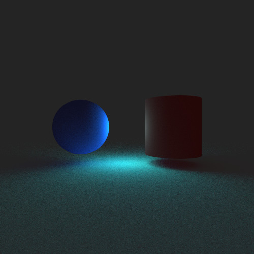
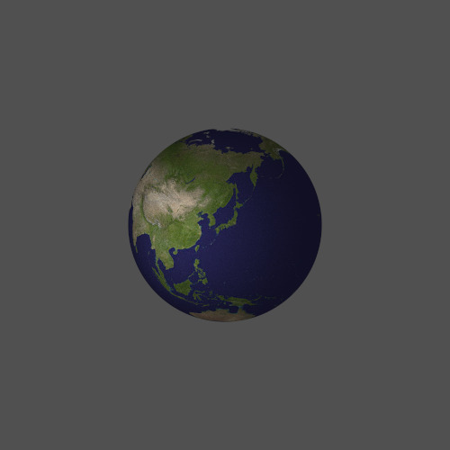

# miniRT


*1920x1080, 10,000샘플 (i9-9900K, 16스레드)*

C언어로 작성된 CPU 기반 패스 트레이서

```bash
./miniRT scene_file.rt
```

# 원리

패스 트레이싱 방식으로 각 픽셀에 도달할 수 있는 광선의 색을 여러번 연산한 후 그 평균을 구합니다. 따라서 샘플의 횟수가 많을수록 현실에 가까운 이미지를 얻을 수 있지만 샘플이 적을 시 노이즈가 많이 발생합니다.

|샘플 1회|샘플 100회|샘플 1000회|
|--------|----------|-----------|
||||

이 프로젝트는 [Ray Tracing in One Weekend](https://raytracing.github.io/books/RayTracingInOneWeekend.html)을 따라 개발되었습니다.

현실에서는 광선이 조명에서 나와 물체에 반사되어 카메라로 진입하지만 패스 트레이싱에서는 불필요한 연산을 하지 않기 위해 광선이 카메라의 한 픽셀에서 나온다고 가정합니다. 그리고 그 광선이 어디에서 발산된 광선인지 역으로 계산해 나간다면 해당 픽셀의 색을 구할 수 있습니다.

- 광선이 아무런 물체에도 교차하지 않을 경우 배경 색으로 간주합니다.
- 광선이 조명에 교차할 경우 이 광선은 조명에서 나온 것입니다. 조명의 색이 곧 광선의 색입니다.
- 광선이 어떤 물체에 교차할 경우 이 광선은 반사광입니다. 어떠한 입사광이 이 반사광을 만들 수 있는지 역산해야 합니다. 이때 입사광을 연산하는 로직은 해당 물체의 속성에 따라 달라집니다.
  - 물체의 경계(hittable)를 방정식으로 표현하여 그 근을 구하면 광선과 물체의 교점을 구할 수 있습니다.
  - 물체의 재질(material)은 광선이 어느 방향으로 반사되는지 결정합니다.
  - 물체의 텍스쳐(texture)는 해당 교점에서의 R, G, B 성분 별 반사율을 결정합니다.
  - 구해낸 입사광의 색은 위 과정을 반복하여 구해야 합니다.

즉 하나의 물체는 3개의 속성을 조합해서 표현할 수 있습니다. 각 속성은 [hittable](includes/hittable.h), [material](includes/material.h), [texture](includes/texture.h) 구조체를 통해 지정합니다.

## 갤러리


*500x500, 1,000샘플 (i9-9900K, 16스레드)*

청색 구, 적색 원기둥, 청록색 조명, 백색 평면

청색 구가 청록색 광선을 적색 원기둥보다 더 잘 반사하고, 구와 원기둥의 반사광이 평면에 나타난 것을 확인할 수 있습니다.


*500x500, 1,000샘플 (i9-9900K, 16스레드)*


*500x500, 1,000샘플 (i9-9900K, 16스레드)*

임의의 이미지를 텍스쳐로 취급하여 래핑할 수 있습니다.
무한한 평면에서는 텍스쳐가 무한히 반복되어 래핑됩니다.


*1000x1000, 10,000샘플 (i9-9900K, 16스레드)*

굴절률을 가진 매질(우측 하단의 구)이 표현된 것을 확인할 수 있습니다.
단순히 반사율 뿐만 아니라 한 물체가 얼마나 반짝이는지 (fuzziness) 표현할 수 있습니다. 예를 들어 최후방의 거울은 반사율 100%, fuzziness 0%로 표현할 수 있고 우측 상단의 원기둥과 원뿔은 fuzziness가 50%에서 100%입니다.

상단의 조명과 조명에서 나온 빛을 정확하게 시뮬레이션했습니다.

## 씬 파일 형식

씬 파일은 `*.rt` 확장자를 가져야 합니다.

씬 파일에 한 줄에 하나의 요소를 기입합니다.

```
<지정자>  <속성 1> <속성 2> <속성 3> ... <속성 n>
```

각 요소마다 기입해야 하는 속성의 개수와 위치가 정해져 있습니다. 예를 들어 **주변광**의 지정자는 `A`이며 순서대로 주변광의 세기, R, G, B 색상값을 입력해야 합니다. 따라서 세기가 `0.02`이며 흰색인 주변광을 지정하고 싶다면 다음과 같이 입력하면 됩니다.

```
A   0.02   255,255,255
```

> 하나의 요소에 대해 가능한 서식이 여러 개 있을 수 있습니다. `scenes/` 디렉토리의 예시를 참고하십시오.

### 기본 원칙

- 지정자가 대문자인 요소는 반드시 필요한 요소입니다. 지정하지 않거나 여러번 지정할 수 없습니다.
- 지정자가 소문자인 요소는 등장하지 않거나 여러번 등장할 수 있습니다.
- 지정자나 각 요소는 탭(`\t`) 또는 공백(` `)으로 구분하면 됩니다.
- 첫 글자가 `#`인 줄은 주석으로 취급합니다.

### 요소의 종류

1. 렌더러 설정
   - 해상도, 샘플 횟수, 최대 광선 추적 깊이 등의 렌더를 어떻게 할 것인지에 대한 속성을 지정합니다.
2. 씬 속성
   - 주변광, 카메라 위치 등 해당 씬의 속성을 지정합니다.
3. 재질, 텍스쳐
   - 텍스쳐를 직접 생성할 수 있습니다.
   - 생성한 텍스쳐를 이용해 재질을 생성할 수 있습니다. 이 재질은 물체에 직접 부여할 수 있습니다.
4. 물체
   - 평면, 구, 원기둥, 직육면체, 원뿔을 생성할 수 있습니다.
   - 물체의 기하학적 속성 (중심점, 방향 등)은 반드시 지정해야 합니다.
   - 물체의 색상만 지정할 경우 램버시안 재질을 가진 것으로 간주합니다. 또는 위에서 직접 생성한 재질을 지정할 수 있습니다.

요소별 자세한 서식은 소스 코드에서 확인할 수 있습니다. 요소를 파싱하는 로직은 [builer](srcs/parser/builder) 디렉토리에 있습니다.

#### 렌더러 설정

- [카메라](srcs/parser/builder/build_setting_camera.c): `camera`
- [디스플레이](srcs/parser/builder/build_setting_display.c): `display`
- [렌더 속성](srcs/parser/builder/build_setting_renderer.c): `renderer`

#### 씬 설정

- [주변광](srcs/parser/builder/build_ambient_lighting.c): `A`
- [카메라](srcs/parser/builder/build_camera.c): `C`

#### 텍스쳐, 재질

- [단색 텍스쳐](srcs/parser/builder/build_texture_solid.c): `tx_solid`
- [이미지 텍스쳐](srcs/parser/builder/build_texture_image.c): `tx_image`
- [체커 텍스쳐](srcs/parser/builder/build_texture_checker.c): `tx_checker`
- [램버시안 재질](srcs/parser/builder/build_material_lambertian.c): `mt_lambertian`
- [금속 재질](srcs/parser/builder/build_material_metal.c): `mt_metal`
- [굴절 재질](srcs/parser/builder/build_material_dielectric.c): `mt_dielectric`
- [무지향성 광원 재질](srcs/parser/builder/build_material_diffuse_light.c): `mt_diffuse_light`

#### 물체

- [광원](srcs/parser/builder/build_light.c): `l`
- [평면](srcs/parser/builder/build_plane_patternmatcher.c): `pl`
- [구](srcs/parser/builder/build_sphere_patternmatcher.c): `sp`
- [원기둥](srcs/parser/builder/build_cylinder_patternmatcher.c): `cy`
- [직육면체](srcs/parser/builder/build_box_patternmatcher.c): `bo`
- [원뿔](srcs/parser/builder/build_cone_patternmatcher.c): `co`

